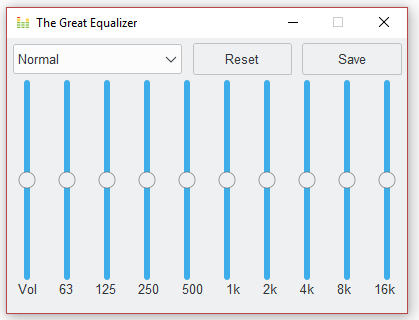

# Media-Equalizer
A media equalizer gui template built using TKinter. Nothing fancy. Just wanted to practice different layouts with TK. Use and abuse freely.

  

I added some functionality to apply presets for various genres. I also added the ability to save a 'custom' preset using the save button.  

This application uses a theme available via the [ttkthemes](https://ttkthemes.readthedocs.io/en/latest/) package. `pip install ttkthemes`. Everything else is standard library. You can also change the theme if you wish.  

If you don't want to use **ttkthemes**, all you need to do is replace `ttkthemes.ThemedStyle` with `ttk.Style`, and then of course set to a theme that you have installed... you can find out what themes you have pre-installed by running the following code:

```python
import tkinter as tk
from tkinter import ttk
style = ttk.Style()
print(style.theme_names())
```
